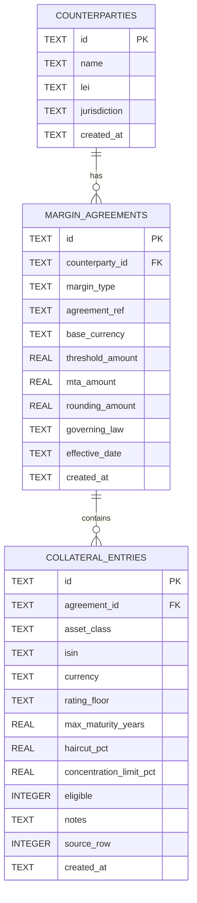
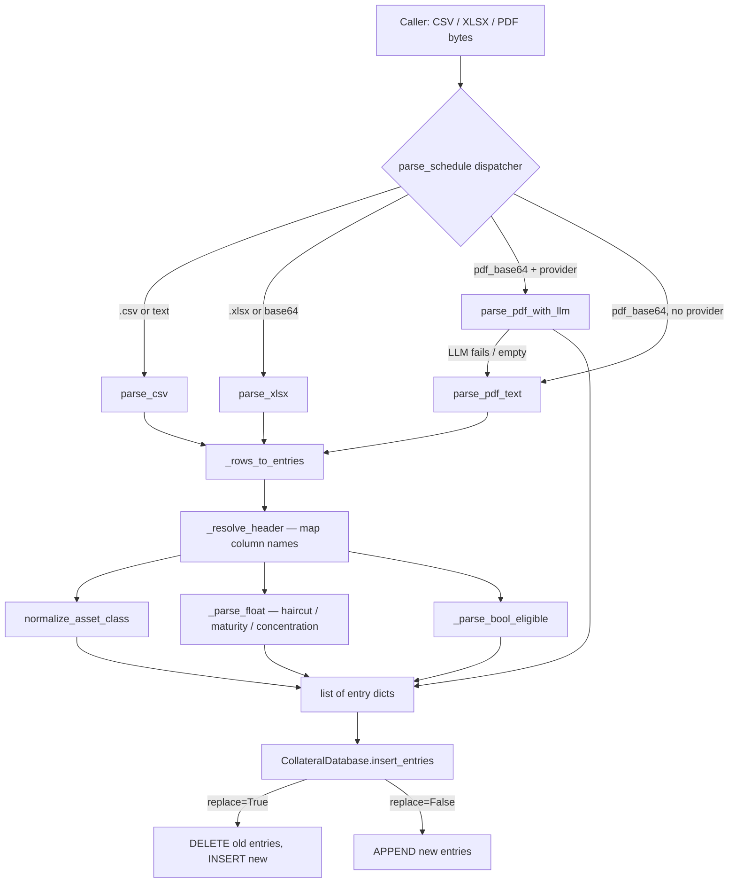

# collateral_schedule — Technical Handoff Document

**Generated:** 2026-07-21
**Package:** `src/collateral_schedule/`
**Status:** Production-ready (v1)

---

## 1. Purpose & Scope

`collateral_schedule` is a **standalone Python library** for ingesting,
normalising, and persisting eligible collateral schedules on a
per-counterparty, per-margin-type basis. It is part of the
opt-intelligence project but has **zero imports from `decision_intelligence`**
and can be used independently by any consumer (CLI, API, notebook, etc.).

**What it does:**
- Accepts collateral schedules as CSV, XLSX, or PDF
- Normalises heterogeneous column headers to a canonical schema
- Maps free-text asset class labels to a controlled vocabulary
- Persists data in a local SQLite database (WAL mode)
- Exposes a clean Python API for CRUD and summary queries

**What it does not do:**
- Drive optimisation (that stays in `decision_intelligence.optimizers`)
- Authenticate users or enforce access control
- Connect to external data sources

---

## 2. Package Structure

```
src/collateral_schedule/
├── __init__.py          Public API: CollateralDatabase, AssetClass,
│                        MarginType, parse_schedule, parse_pdf_with_llm,
│                        LLMCollateralSchedule
├── models.py            Enums, COLUMN_ALIASES, ASSET_CLASS_ALIASES,
│                        normalisers
├── database.py          CollateralDatabase — SQLite CRUD + schema init
├── parser.py            parse_csv / parse_xlsx / parse_pdf_text /
│                        parse_schedule dispatcher (optional LLM provider)
├── llm_parser.py        parse_pdf_with_llm — provider-agnostic LLM PDF path;
│                        LLMCollateralSchedule extraction schema
└── handoff_generator.py This generator (LLM + deterministic paths)
```

**Consumer scripts (not part of the library):**

- `scripts/run_collateral_llm.py` — wires an LLM provider (local Ollama by
  default, or any configured provider) and runs `parse_pdf_with_llm` over
  every document in `examples/collateral/`.

**Consumed by (not part of this package):**
- `src/decision_intelligence/api/app.py` — REST endpoints
- `examples/collateral/` — sample schedule files

---

## 3. Data Model

### Entity-relationship diagram



### DDL summary

```
counterparties (id, name, lei, jurisdiction, created_at)
margin_agreements (id, counterparty_id, margin_type, agreement_ref,
base_currency, threshold_amount, mta_amount, rounding_amount,
governing_law, effective_date, created_at)
collateral_entries (id, agreement_id, asset_class, isin, currency,
rating_floor, max_maturity_years, haircut_pct,
concentration_limit_pct, eligible, notes, source_row, created_at)
```

**Indexes:**
- `idx_entries_agreement` on `collateral_entries(agreement_id)`
- `idx_agreements_counterparty` on `margin_agreements(counterparty_id)`

---

## 4. Margin Types

- **IM**
- **VM**
- **REPO**
- **SBL**
- **CCP_IM**
- **HOUSE**
- **OTHER**

Each agreement links exactly one counterparty to one margin type.
A counterparty may have multiple agreements (e.g. both an IM and a VM
schedule with the same dealer).

---

## 5. Ingestion Pipeline



**Algorithm:**
1. Detect file type from filename extension or MIME type; try CSV then XLSX as fallback.
2. Find the first non-empty row as the header row (skips blank leading rows).
3. For each header cell, call `_resolve_header()` which lowercases, strips, and compares against all entries in `COLUMN_ALIASES`.
4. For each data row, apply type-specific converters: float parsing strips `%`, `,`, and whitespace; eligibility accepts `0/1`, `true/false`, `yes/no`, `eligible/ineligible`.
5. Rows where no field resolved are skipped.
6. `asset_class` is mapped via `normalize_asset_class()` which tries exact match then prefix match against `ASSET_CLASS_ALIASES`; unrecognised values become `OTHER`.

### 5.1 LLM PDF path (`parse_pdf_with_llm`)

For structured PDFs where the text heuristic parses poorly, pass an LLM
`provider` to `parse_schedule(..., provider=...)` (or call `parse_pdf_with_llm`
directly). The path is **LLM-first with heuristic fallback**: if the model
errors or returns no rows, `parse_pdf_text` runs.

**Provider-agnostic by dependency injection** — the caller constructs the
provider and passes it in, so `collateral_schedule` keeps **zero imports from
`decision_intelligence`** (§10). Any object with `supports_native_pdf: bool`
and `extract(schema, *, instruction, system, pdf_path, text)` works.

- **Native-PDF providers** (Anthropic/Claude): the raw PDF bytes are sent
  directly, preserving table layout.
- **Text providers** (OpenAI-compatible / local **Ollama** / vLLM): the PDF
  text is extracted locally via `pypdf` and truncated to `max_text_chars`
  (default 24 000) to keep local models tractable.

The model returns a validated `LLMCollateralSchedule` (a `pydantic` schema of
`entries: list[LLMCollateralEntry]` plus optional `base_currency` /
`detected_margin_type` context). Each entry's free-text `asset_class` and
`eligible` are then run through the same `normalize_asset_class()` /
`normalize_eligible()` used by the CSV path, so downstream
`insert_entries` is identical regardless of source.

Run it over the bundled examples with:

```
python scripts/run_collateral_llm.py --dir examples/collateral --glob '*.pdf'
```

The script auto-selects a provider: any configured one
(`ANTHROPIC_API_KEY` / `OPENAI_API_KEY` / `DI_LLM_*`), else a local Ollama
server (`http://localhost:11434`) by default.

---

## 6. Column Normalisation Rules

Any of the following header spellings is accepted for each canonical field:

| Canonical field | Accepted headers (sample) |
|---|---|
| `asset_class` | `asset_class`, `asset class`, `collateral type`, `collateral_type`, `security type` … |
| `isin` | `isin`, `cusip`, `identifier`, `security id`, `sec_id` … |
| `currency` | `currency`, `ccy`, `curr`, `denomination` |
| `rating_floor` | `rating_floor`, `rating floor`, `minimum rating`, `min rating`, `min_rating` … |
| `max_maturity_years` | `max_maturity_years`, `max maturity`, `maximum maturity`, `maturity (years)`, `maturity years` … |
| `haircut_pct` | `haircut_pct`, `haircut`, `haircut (%)`, `hc`, `hc (%)` … |
| `concentration_limit_pct` | `concentration_limit_pct`, `concentration limit`, `concentration (%)`, `conc limit`, `conc. limit` … |
| `eligible` | `eligible`, `eligibility`, `accepted`, `allowed`, `permitted` … |
| `notes` | `notes`, `comments`, `remarks`, `description`, `note` |

Headers are compared case-insensitively with hyphens and underscores
replaced by spaces.

---

## 7. Asset Class Mapping

| Canonical | Example input strings |
|---|---|
| `CASH` | cash |
| `GOVT` | government |
| `GOVT` | govt |
| `GOVT` | sovereign |
| `GOVT` | treasury |
| `GOVT` | treasuries |
| `AGENCY` | agency |
| `AGENCY` | gse |
| `CORP` | corporate |
| `CORP` | corp |
| `CORP` | investment grade |
| `CORP` | ig corp |
| … | … |

Matching is exact then prefix. Unrecognised → `OTHER`.

---

## 8. REST API Reference

All endpoints are mounted on the `decision_intelligence` FastAPI app.
The `collateral_schedule` library itself has no HTTP layer.

```
POST   /api/collateral/counterparties                    Create counterparty
GET    /api/collateral/counterparties                    List counterparties
POST   /api/collateral/agreements                        Create agreement
GET    /api/collateral/agreements?counterparty_id=&margin_type=
GET    /api/collateral/agreements/{id}
POST   /api/collateral/agreements/{id}/ingest            Upload schedule file
GET    /api/collateral/agreements/{id}/schedule?asset_class=&eligible_only=
DELETE /api/collateral/agreements/{id}/schedule
GET    /api/collateral/schema                            Column alias reference
```

### Key request/response shapes

**POST /api/collateral/counterparties**
```json
// Request
{ "name": "Goldman Sachs", "lei": "784F5XWPLTWKTBV3E584", "jurisdiction": "US" }
// Response
{ "id": "cp_abc123", "name": "Goldman Sachs", "lei": "...", "created_at": "..." }
```

**POST /api/collateral/agreements**
```json
// Request
{
"counterparty_id": "cp_abc123", "margin_type": "VM",
"agreement_ref": "ISDA-2002-001", "base_currency": "USD",
"threshold_amount": 500000, "mta_amount": 100000,
"governing_law": "English"
}
```

**POST /api/collateral/agreements/{id}/ingest**
```json
// CSV path
{ "csv_content": "Asset Class,Haircut (%)\nGOVT,2.0\n...", "replace": true }
// XLSX path
{ "xlsx_base64": "<base64>", "filename": "schedule.xlsx", "replace": true }
// PDF path
{ "pdf_base64": "<base64>", "filename": "schedule.pdf", "replace": true }
// Response
{ "agreement_id": "agr_xyz", "entries_inserted": 12, "replaced": true,
"summary": { "total_entries": 12, "eligible_count": 9,
"min_haircut_pct": 0.0, "max_haircut_pct": 20.0,
"avg_haircut_pct": 6.75,
"eligible_asset_classes": ["CASH","GOVT","CORP","MMF"] } }
```

**GET /api/collateral/agreements/{id}/schedule?eligible_only=true**
```json
{ "agreement_id": "agr_xyz",
"entries": [
{ "id": "ce_...", "asset_class": "GOVT", "isin": "US912828ZT",
"currency": "USD", "rating_floor": "A-", "max_maturity_years": 30,
"haircut_pct": 2.0, "concentration_limit_pct": 40.0,
"eligible": true, "notes": "UST on-the-run" }
],
"summary": { ... } }
```

---

## 9. Standalone Usage (no decision_intelligence)

```python
from collateral_schedule import CollateralDatabase, parse_schedule

# 1. Initialise DB (defaults to ~/.decision_intelligence/collateral.db)
db = CollateralDatabase("/path/to/collateral.db")

# 2. Register a counterparty
cp = db.create_counterparty("Goldman Sachs", lei="784F5XWPLTWKTBV3E584")

# 3. Create a VM agreement
agr = db.create_agreement(
counterparty_id=cp["id"],
margin_type="VM",
agreement_ref="ISDA-2002-001",
base_currency="USD",
threshold_amount=500_000,
mta_amount=100_000,
governing_law="English",
)

# 4. Parse and ingest a schedule
with open("vm_schedule.csv") as f:
entries = parse_schedule(f.read(), filename="vm_schedule.csv")
db.insert_entries(agr["id"], entries, replace=True)

# 5. Query eligible GOVT entries
rows = db.list_entries(agr["id"], asset_class="GOVT", eligible_only=True)
for row in rows:
print(row["isin"], row["haircut_pct"])

# 6. Get summary
print(db.summary(agr["id"]))
```

---

## 10. Integration with decision_intelligence

The `decision_intelligence.api.app` module wires the library into REST:

```python
# app.py (consumer — not part of collateral_schedule)
from collateral_schedule import CollateralDatabase, parse_schedule

_COLLATERAL_DB = CollateralDatabase()   # singleton at app startup
```

The 9 REST endpoints in app.py are thin adapters: they validate Pydantic
schemas, call `_COLLATERAL_DB` methods, and serialise responses.
No business logic lives in app.py — it all stays in `collateral_schedule`.

**Future integration:** the `CollateralOptimizer` can replace its CSV
fixture reads with `_COLLATERAL_DB.list_entries(agreement_id, eligible_only=True)`
once counterparty context is threaded through the `OptimizationRequest`.

---

## 11. Extension Points

| Extension | Where to change |
|---|---|
| New margin type | Add to `MarginType` enum in `models.py` |
| New column alias | Add to `COLUMN_ALIASES` dict in `models.py` |
| New asset class | Add to `AssetClass` enum + `ASSET_CLASS_ALIASES` in `models.py` |
| LLM-assisted PDF parsing | ✅ **Implemented** — `parse_pdf_with_llm(pdf, provider)` in `llm_parser.py`; pass `provider=` to `parse_schedule` (LLM-first, heuristic fallback). See §5.1 |
| New file format (XML, JSON) | Add `parse_xml` / `parse_json` in `parser.py`; extend dispatcher in `parse_schedule` |
| Multi-tenant DB | Pass a tenant-specific `path` to `CollateralDatabase(path=...)` |
| Postgres | Replace `sqlite3` with `psycopg2`/`asyncpg` in `database.py`; SQL is ANSI-compatible |

---

## 12. Testing Approach

**Unit tests** (no DB, no HTTP):
- `parse_csv` with all-alias headers → verify canonical fields populated
- `parse_csv` with missing `haircut_pct` column → verify skipped gracefully
- `normalize_asset_class("government bonds")` → `"GOVT"`
- `normalize_eligible("No")` → `False`

**Integration tests** (in-memory SQLite via `CollateralDatabase(":memory:")`):
- Round-trip: create counterparty → agreement → insert entries → list entries → summary
- `replace=True` clears old entries before inserting new ones
- Filter `eligible_only=True` returns only rows where `eligible=1`

**Sample files** (in `examples/collateral/`):

_CSV fixtures (deterministic path):_

- `sample_vm_schedule.csv` — 12 rows, VM, mixed eligible/ineligible
- `sample_repo_schedule.csv` — 11 rows, REPO, GC + haircut tiers

_Real structured documents (LLM path — exercise `parse_pdf_with_llm`):_

- `Example1_ex99-k2i.pdf` — SEC exhibit; text-sparse (image-heavy) — good
  negative/OCR test case
- `Example2_acceptable-collateral-futures-options-select-forwards.pdf` — CME
  acceptable-collateral schedule (cash, LCs, gold warrants, IEF2 funds)
- `Example3_GSD-Haircut-Schedule-Current.pdf` — FICC/GSD haircut schedule with
  maturity-band tiers (UST, agency, MBS)
- `Example4_DTC-Haircut-Schedule.pdf` — DTC collateral haircut schedule
  (rating- and maturity-tiered)
- `Example5_EX-10.03.pdf` — ISDA/CSA agreement excerpt (cash-collateral terms)
- `Example6_synthetic-triparty-eligibility-profile.txt` — small synthetic
  triparty eligibility profile (fast round-trip smoke test)
- `fed-discount-window-collateral-valuation.pdf` — Fed discount-window
  collateral margins table

**Reference run** (local Ollama `llama3.2`, text path, 24 k-char cap):
`scripts/run_collateral_llm.py` extracted **83 entries across the 6 PDFs**.
This is a functional baseline, **not** an accuracy target — see limitation #1
for the levers (native-PDF provider, table extraction, constrained schema).

Run against the API with `curl -X POST /api/collateral/agreements/{id}/ingest`
using the CSV samples, or run the LLM path end-to-end with
`python scripts/run_collateral_llm.py`.

---

## 13. Known Limitations & Next Steps

| # | Limitation | Suggested fix |
|---|---|---|
| 1 | ~~PDF parser uses text-heuristic extraction; structured PDFs parse poorly~~ **Partly addressed:** LLM path (§5.1) added. Accuracy on flattened-text providers (Ollama) is still limited; native-PDF (Claude) and table-aware pre-extraction remain the next levers | Use a native-PDF provider; add `pdfplumber` **table** extraction to feed clean input; constrain `asset_class` to the enum; model maturity tiers; build an eval harness with a labelled gold set |
| 2 | No version history for schedule entries | Add `version` integer to `margin_agreements`; keep old entries with a `superseded_at` timestamp |
| 3 | No ISIN validation | Integrate `isin` PyPI package or checksum validator in `parser.py` |
| 4 | No rating normalisation (S&P vs Moody's vs Fitch) | Add `normalize_rating(raw)` in `models.py` mapping `"Aaa"→"AAA"`, `"Baa3"→"BBB-"` etc. |
| 5 | Collateral optimizer still reads from CSV fixtures | Thread `agreement_id` through `OptimizationRequest.context`; update `CollateralOptimizer` to call `_COLLATERAL_DB.list_entries` |
| 6 | Single-file SQLite can't scale to thousands of counterparties | Add Postgres adapter in `database.py` (schema is ANSI SQL) |
| 7 | No UI for editing individual entries post-ingest | Add inline edit / delete row to `CollateralSchedulePanel` in the frontend |

---

## 14. Glossary

| Term | Definition |
|---|---|
| **IM** | Initial Margin — collateral posted to cover potential future exposure |
| **VM** | Variation Margin — daily mark-to-market collateral under a CSA |
| **REPO** | Repurchase agreement — short-term borrowing secured by collateral |
| **SBL** | Securities Borrowing & Lending — lending securities against collateral |
| **CCP_IM** | Central Counterparty Initial Margin — margin posted to a CCP/exchange |
| **CSA** | Credit Support Annex — ISDA agreement governing VM collateral |
| **Haircut** | Percentage reduction applied to the market value of collateral |
| **MTA** | Minimum Transfer Amount — smallest margin call that triggers a transfer |
| **GC** | General Collateral — standard-quality collateral for repo |
| **ISDA** | International Swaps and Derivatives Association |
| **LEI** | Legal Entity Identifier — 20-character ISO 17442 code |
| **WAL** | Write-Ahead Logging — SQLite journal mode for concurrency safety |